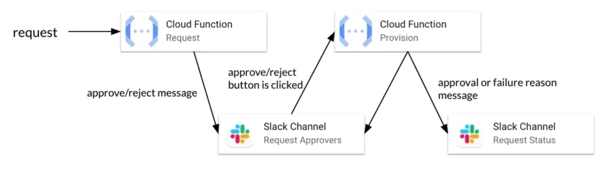
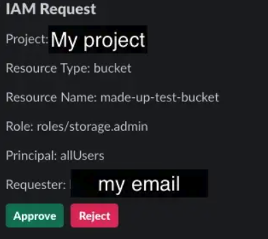

# slack_approval


This python library serves as the basis for managing and deploying a lightweight approval workflow based on Slack and GCP. This library contains two key classes, `SlackRequest` and `SlackProvision` as well as the logic to deploy them to GCP, which is based on [goblet](https://github.com/goblet/goblet). 

Install library with `pip install slack_approval`

## Slack Approval Flow 
______________________



The user iniates a request to the reqest function. This function uses the `SlackRequest` class to then post a message into a private Slack channel with the option to approve or reject the request. 

Sample message in the approvers channel. 



If approved by a member of the private channel, the message is then sent to the provision function, which executes logic based on the request. There is a second Slack channel for requesters to view the status of their request.


## Onboarding New Requests for Approval
______________________________________

Provision

  * First add a provision file for your new request `provision_{request name}.py`
  * In the file, extend the `from slack_approval.slack_provision import SlackProvision` 
    class and define your own `approved()` and optionally a `rejected()` method. By default, 
    rejections log the event in the function and updates the messages in Slack. You only 
    need to define it if other actions are necessary.
  * Import your new class in `provision.py`. This should be the only thing you need to change
    anything else in the base files

Request

  * The only requirement for the events sent to the request function is the `provision_class`
    field. This is what maps the event to the right class in the provision function. You can
    add any other fields here and they will show up in the request in Slack.
      * The value for `provision_class` should be the name of your provision class with spaces
        
        ie. class `ProvisionLBEndpoint` -> `"provision_class": "Provision LB Endpoint"`
  * Optionally, you can add `approvers_channel` and `requesters_channel` fields in your request to specify the approvers and requesters channels respectively. 
    * If added, add environment variables with the same values. 
    * If not provided, the function will look for APPROVERS_CHANNEL and REQUESTERS_CHANNEL environment variables by default.

Example:
``` bash
curl -X POST -H "Content-Type:application/json" https://REGION-PROJECT.cloudfunctions.net/slack-request -d '{
	"provision_class": "Provision Service",
    "approvers_channel": "APPROVERS_CHANNEL",
    "requesters_channel": "REQUESTERS_CHANNEL",
	"field1": "value1",
	"field2": "value2",
}'
```

  * The entire data json is available to the provision classes as `self.inputs`


## Deploying Functions
_______________________

The functions that need to be deployed are found in the `/functions` folder or can be created by the `slack_approval init` command. 

See the blog post [Tutorial: Setting Up Approval Processes with Slack Apps](https://engineering.premise.com/tutorial-setting-up-approval-processes-with-slack-apps-d325aee31763) for more detailed slack and GCP setup steps.

Before deploying you will need to modify the `config.json` file found in the `.goblet` folder with the required environment variables. 

### Request
* APPROVERS_CHANNEL
* REQUESTERS_CHANNEL
* SLACK_BOT_TOKEN

### Provision
* SLACK_BOT_TOKEN

To deploy the functions all you need to do is run the following two commands.

* `goblet deploy --stage request` 

* `goblet deploy --stage provision`

## Blog post
____________
See the blog post [Tutorial: Setting Up Approval Processes with Slack Apps](https://engineering.premise.com/tutorial-setting-up-approval-processes-with-slack-apps-d325aee31763) for more detailed slack and GCP setup steps.